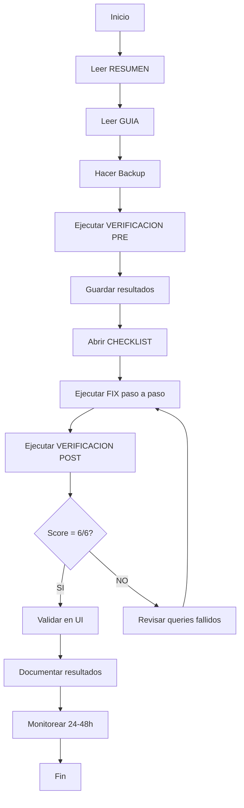

# 📚 Índice de Documentación - Corrección de Datos

> Fecha de creación: 2026-01-16  
> Análisis basado en: `supabase archivos/*.csv`  
> Estado: ✅ Documentación completa, pendiente ejecución

---

## 🎯 Punto de Entrada

**Comienza aquí si eres nuevo:** [RESUMEN_CORRECCION_DATOS.md](./RESUMEN_CORRECCION_DATOS.md)

---

## 📄 Documentos por Tipo

### 🔴 **Documentos Críticos (Lectura Obligatoria)**

1. **[RESUMEN_CORRECCION_DATOS.md](./RESUMEN_CORRECCION_DATOS.md)** ⭐
   - **Público:** Todos (ejecutivos, desarrolladores, administradores)
   - **Contenido:** Resumen ejecutivo de problemas y soluciones
   - **Tiempo de lectura:** 10 minutos
   - **Cuándo leer:** ANTES de cualquier acción

2. **[CHECKLIST_EJECUCION.md](./CHECKLIST_EJECUCION.md)** ⭐
   - **Público:** Ejecutor del fix
   - **Contenido:** Lista de verificación paso a paso
   - **Tiempo de ejecución:** 30-40 minutos
   - **Cuándo usar:** DURANTE la ejecución del fix

### 🟠 **Documentos Técnicos (Ejecución)**

3. **[FIX_DATOS_SUPABASE.sql](./FIX_DATOS_SUPABASE.sql)** ⭐⭐⭐
   - **Público:** Administrador de base de datos
   - **Contenido:** Script SQL con todas las correcciones
   - **Líneas:** 300+
   - **Cuándo ejecutar:** Después de backup, siguiendo la guía

4. **[VERIFICACION_INTEGRIDAD.sql](./VERIFICACION_INTEGRIDAD.sql)** ⭐⭐
   - **Público:** Administrador de base de datos / QA
   - **Contenido:** Script de verificación automática (7 secciones)
   - **Líneas:** 400+
   - **Cuándo ejecutar:** ANTES y DESPUÉS del fix

5. **[GUIA_CORRECCION_DATOS.md](./GUIA_CORRECCION_DATOS.md)** ⭐⭐
   - **Público:** Ejecutor del fix, desarrolladores
   - **Contenido:** Guía paso a paso con queries y validaciones
   - **Tiempo de lectura:** 15 minutos
   - **Cuándo leer:** ANTES de ejecutar el fix

### 🟡 **Documentos de Referencia**

6. **[CHANGELOG_CORRECCION_DATOS.md](./CHANGELOG_CORRECCION_DATOS.md)**
   - **Público:** Equipo técnico, stakeholders
   - **Contenido:** Historial detallado de análisis y cambios
   - **Cuándo leer:** Para contexto histórico o auditoría

7. **[INDEX_CORRECCION_DATOS.md](./INDEX_CORRECCION_DATOS.md)** (este documento)
   - **Público:** Todos
   - **Contenido:** Índice de documentos y cómo navegarlos
   - **Cuándo leer:** Para encontrar el documento correcto

---

## 🗂️ Documentos por Rol

### 👨‍💼 **Ejecutivo / Director**
**Tiempo:** 10 minutos

1. Lee: [RESUMEN_CORRECCION_DATOS.md](./RESUMEN_CORRECCION_DATOS.md)
   - Sección: "Resumen Ejecutivo"
   - Sección: "Problemas Detectados"
   - Sección: "Plan de Acción"

### 👨‍💻 **Desarrollador / Administrador de BD**
**Tiempo:** 45 minutos (lectura) + 30-40 minutos (ejecución)

1. Lee: [RESUMEN_CORRECCION_DATOS.md](./RESUMEN_CORRECCION_DATOS.md) - completo
2. Lee: [GUIA_CORRECCION_DATOS.md](./GUIA_CORRECCION_DATOS.md) - completo
3. Revisa: [FIX_DATOS_SUPABASE.sql](./FIX_DATOS_SUPABASE.sql) - comentarios y queries
4. Usa: [CHECKLIST_EJECUCION.md](./CHECKLIST_EJECUCION.md) - durante ejecución
5. Ejecuta: [VERIFICACION_INTEGRIDAD.sql](./VERIFICACION_INTEGRIDAD.sql) - antes/después

### 🧪 **QA / Tester**
**Tiempo:** 20 minutos

1. Lee: [RESUMEN_CORRECCION_DATOS.md](./RESUMEN_CORRECCION_DATOS.md)
   - Sección: "Validación Final"
2. Lee: [GUIA_CORRECCION_DATOS.md](./GUIA_CORRECCION_DATOS.md)
   - Sección: "Validación en la UI"
3. Usa: [CHECKLIST_EJECUCION.md](./CHECKLIST_EJECUCION.md)
   - Sección: "Validación en UI"

### 📊 **Auditor / Stakeholder**
**Tiempo:** 15 minutos

1. Lee: [RESUMEN_CORRECCION_DATOS.md](./RESUMEN_CORRECCION_DATOS.md)
2. Lee: [CHANGELOG_CORRECCION_DATOS.md](./CHANGELOG_CORRECCION_DATOS.md)
   - Sección: "Problemas identificados"
   - Sección: "Soluciones implementadas"
   - Sección: "Lecciones aprendidas"

---

## 🔄 Flujo de Trabajo Completo



### Paso a Paso

1. **Preparación** (15 min)
   - [ ] Leer [RESUMEN_CORRECCION_DATOS.md](./RESUMEN_CORRECCION_DATOS.md)
   - [ ] Leer [GUIA_CORRECCION_DATOS.md](./GUIA_CORRECCION_DATOS.md)
   - [ ] Hacer backup de Supabase

2. **Verificación PRE** (5 min)
   - [ ] Ejecutar [VERIFICACION_INTEGRIDAD.sql](./VERIFICACION_INTEGRIDAD.sql)
   - [ ] Guardar resultados (score y problemas)

3. **Ejecución** (30-40 min)
   - [ ] Abrir [CHECKLIST_EJECUCION.md](./CHECKLIST_EJECUCION.md)
   - [ ] Seguir paso a paso
   - [ ] Ejecutar [FIX_DATOS_SUPABASE.sql](./FIX_DATOS_SUPABASE.sql) sección por sección

4. **Verificación POST** (5 min)
   - [ ] Ejecutar [VERIFICACION_INTEGRIDAD.sql](./VERIFICACION_INTEGRIDAD.sql)
   - [ ] Comparar con resultados PRE

5. **Validación UI** (10 min)
   - [ ] Seguir checklist de [GUIA_CORRECCION_DATOS.md](./GUIA_CORRECCION_DATOS.md)
   - [ ] Verificar casos de prueba específicos

6. **Post-ejecución** (5 min)
   - [ ] Documentar resultados en [CHECKLIST_EJECUCION.md](./CHECKLIST_EJECUCION.md)
   - [ ] Notificar a equipo
   - [ ] Programar monitoreo

---

## 📊 Estadísticas de Documentación

| Documento | Líneas | Palabras | Tiempo lectura |
|-----------|--------|----------|----------------|
| RESUMEN_CORRECCION_DATOS.md | ~450 | ~3,000 | 10 min |
| FIX_DATOS_SUPABASE.sql | ~300 | ~2,000 | 15 min |
| GUIA_CORRECCION_DATOS.md | ~500 | ~3,500 | 15 min |
| VERIFICACION_INTEGRIDAD.sql | ~400 | ~2,500 | 10 min |
| CHECKLIST_EJECUCION.md | ~600 | ~3,000 | 5 min |
| CHANGELOG_CORRECCION_DATOS.md | ~350 | ~2,500 | 10 min |
| INDEX_CORRECCION_DATOS.md | ~200 | ~1,500 | 5 min |
| **TOTAL** | **~2,800** | **~18,000** | **70 min** |

---

## 🎯 Resumen de Problemas

### 6 Problemas Identificados

| # | Problema | Severidad | Casos | Solución |
|---|----------|-----------|-------|----------|
| 1 | stage_sla incompleto | 🔴 Alta | Todos | UPDATE días faltantes |
| 2 | Seguimientos duplicados (backfill) | 🟠 Media | ~15 | DELETE con filtro |
| 3 | Seguimientos Sistema repetidos | 🟠 Media | ~10 | DELETE con CTE |
| 4 | Casos cerrados sin timestamp | 🟡 Baja | ~20 | UPDATE closed_at |
| 5 | Due dates no calculados | 🔴 Alta | ~5 | UPDATE con función |
| 6 | Followups sin due_date | 🟠 Media | ~120 | UPDATE con JOIN |

---

## 📁 Estructura de Archivos

```
/workspaces/convivencia-escolar/
├── docs/
│   ├── RESUMEN_CORRECCION_DATOS.md      ⭐ Resumen ejecutivo
│   ├── FIX_DATOS_SUPABASE.sql           ⭐⭐⭐ Script de corrección
│   ├── GUIA_CORRECCION_DATOS.md         ⭐⭐ Guía paso a paso
│   ├── VERIFICACION_INTEGRIDAD.sql      ⭐⭐ Script de verificación
│   ├── CHECKLIST_EJECUCION.md           ⭐ Lista de verificación
│   ├── CHANGELOG_CORRECCION_DATOS.md    Historial de cambios
│   └── INDEX_CORRECCION_DATOS.md        Este documento
│
└── supabase archivos/
    ├── cases_rows.csv                   Datos analizados
    ├── case_followups_rows.csv          Datos analizados
    ├── stage_sla_rows.csv               Datos analizados
    └── involucrados_rows.csv            Datos analizados
```

---

## 🔗 Enlaces Rápidos

### Documentos Principales
- [📄 Resumen Ejecutivo](./RESUMEN_CORRECCION_DATOS.md)
- [✅ Checklist de Ejecución](./CHECKLIST_EJECUCION.md)
- [🔧 Script SQL de Corrección](./FIX_DATOS_SUPABASE.sql)
- [🔍 Script de Verificación](./VERIFICACION_INTEGRIDAD.sql)

### Guías y Tutoriales
- [📖 Guía Paso a Paso](./GUIA_CORRECCION_DATOS.md)
- [📝 Changelog Detallado](./CHANGELOG_CORRECCION_DATOS.md)

### Documentos Relacionados
- [🐛 Solución Error 400 Followup](../SOLUCION_ERROR_400_FOLLOWUP.md)
- [📅 Cambios SLA](../README_CAMBIOS_SLA.md)
- [🔄 Migrations Runbook](./MIGRATIONS_RUNBOOK.md)

---

## ❓ Preguntas Frecuentes

### ¿Por dónde empiezo?
👉 Lee [RESUMEN_CORRECCION_DATOS.md](./RESUMEN_CORRECCION_DATOS.md)

### ¿Cuánto tiempo toma?
⏱️ 30-40 minutos de ejecución + 10 minutos de validación

### ¿Es seguro?
✅ Sí, si sigues la guía y haces backup primero

### ¿Puedo ejecutar en horario laboral?
⚠️ No recomendado. Mejor fin de semana o fuera de horario.

### ¿Qué pasa si algo sale mal?
🆘 Restaurar desde backup y revisar [CHECKLIST_EJECUCION.md](./CHECKLIST_EJECUCION.md) → "Si algo sale mal"

### ¿Necesito permisos especiales?
👤 Sí, acceso de administrador a Supabase SQL Editor

### ¿Puedo ejecutar parcialmente?
⚠️ No recomendado. Los pasos están ordenados y son dependientes.

### ¿Cómo sé si funcionó?
📊 Score final debe ser 6/6 en [VERIFICACION_INTEGRIDAD.sql](./VERIFICACION_INTEGRIDAD.sql)

---

## 📞 Soporte

### Si necesitas ayuda:
1. Revisa el documento relevante según tu rol (arriba)
2. Consulta la sección "Si algo sale mal" en [CHECKLIST_EJECUCION.md](./CHECKLIST_EJECUCION.md)
3. Comparte resultados de [VERIFICACION_INTEGRIDAD.sql](./VERIFICACION_INTEGRIDAD.sql)

### Para reportar problemas:
- Incluye screenshots
- Copia mensajes de error completos
- Indica qué paso estabas ejecutando
- Comparte el score de verificación

---

## 🎓 Mejores Prácticas

1. **SIEMPRE** hacer backup antes de modificar datos
2. **NUNCA** ejecutar queries en producción sin probar en dev
3. **VERIFICAR** resultados después de cada paso
4. **DOCUMENTAR** lo que hiciste para auditoría
5. **MONITOREAR** por 24-48h después del fix

---

## ✅ Estado del Proyecto

- ✅ Análisis completado
- ✅ Problemas identificados (6)
- ✅ Scripts SQL creados
- ✅ Documentación completa
- ✅ Guías de ejecución listas
- ✅ Verificación automatizada
- ⏳ Backup pendiente
- ⏳ Ejecución pendiente
- ⏳ Validación pendiente

---

**Última actualización:** 2026-01-16  
**Versión:** 1.0  
**Autor:** GitHub Copilot  
**Estado:** ✅ Documentación completa
